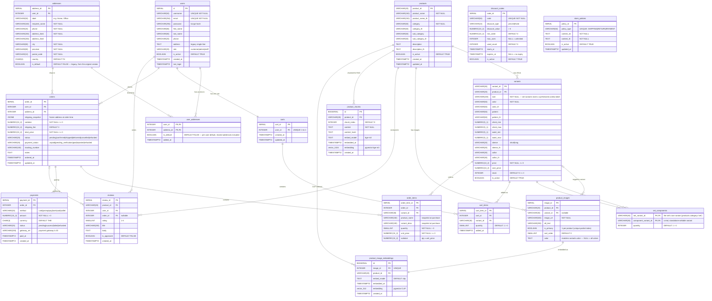

# Entity-Relationship Diagram — Kevin Web Shopping

Thai fashion e-commerce platform with AI chatbot (PostgreSQL 15 + pgvector).

> **Render options:**
> - GitHub: renders automatically in `.md` files
> - VS Code: install "Markdown Preview Mermaid Support" extension
> - Online: paste the `mermaid` block at [mermaid.live](https://mermaid.live)
> - CLI: `npx @mermaid-js/mermaid-cli -i ER_DIAGRAM.md -o ER_DIAGRAM.png`

---

```mermaid
erDiagram

    %% ─── CATALOGUE ───────────────────────────────────────────
    products {
        VARCHAR(20)     product_id      PK
        VARCHAR(150)    product_name    "NOT NULL"
        VARCHAR(150)    product_name_th
        VARCHAR(50)     category        "NOT NULL"
        VARCHAR(50)     category_th
        VARCHAR(50)     sub_category
        VARCHAR(50)     sub_category_th
        TEXT            description
        TEXT            description_th
        BOOLEAN         is_active       "DEFAULT TRUE"
        TIMESTAMPTZ     created_at
        TIMESTAMPTZ     updated_at
    }

    variants {
        VARCHAR(30)     variant_id      PK
        VARCHAR(20)     product_id      FK
        VARCHAR(100)    size            "NOT NULL — set-variants store a synthesized combo label"
        VARCHAR(50)     color           "NOT NULL"
        VARCHAR(50)     color_th
        VARCHAR(50)     pattern
        VARCHAR(50)     pattern_th
        NUMERIC(5_1)    chest_min
        NUMERIC(5_1)    chest_max
        NUMERIC(5_1)    waist_min
        NUMERIC(5_1)    waist_max
        VARCHAR(20)     sleeve          "short|long"
        VARCHAR(20)     sleeve_th
        VARCHAR(30)     collar
        VARCHAR(30)     collar_th
        NUMERIC(10_2)   price           "NOT NULL >= 0"
        NUMERIC(10_2)   cost_price
        INTEGER         stock           "DEFAULT 0 >= 0"
        BOOLEAN         is_active       "DEFAULT TRUE"
    }

    product_images {
        SERIAL          image_id        PK
        VARCHAR(20)     product_id      FK
        VARCHAR(30)     variant_id      FK "nullable"
        VARCHAR(500)    image_url       "NOT NULL"
        VARCHAR(200)    alt_text
        BOOLEAN         is_primary      "1 per product (unique partial index)"
        SMALLINT        sort_order      "DEFAULT 0"
        TEXT            color           "matches variants.color — NULL = all colors"
    }

    set_components {
        VARCHAR(30)     set_variant_id       PK,FK "the set's own variant (products.category='set')"
        VARCHAR(30)     component_variant_id PK,FK "a real, standalone-sellable variant"
        INTEGER         quantity             "DEFAULT 1 > 0"
    }

    %% ─── USERS & ADDRESSES ───────────────────────────────────
    users {
        SERIAL          id              PK
        VARCHAR(50)     username        "UNIQUE NOT NULL"
        VARCHAR(254)    email           "UNIQUE NOT NULL"
        VARCHAR(255)    password        "bcrypt hash"
        VARCHAR(80)     first_name
        VARCHAR(80)     last_name
        VARCHAR(20)     phone
        TEXT            address         "legacy single-line"
        VARCHAR(20)     role            "customer|admin|staff"
        BOOLEAN         is_active       "DEFAULT TRUE"
        TIMESTAMPTZ     created_at
        TIMESTAMPTZ     last_login
    }

    addresses {
        SERIAL          address_id      PK
        INTEGER         user_id         FK
        VARCHAR(50)     label           "e.g. Home, Office"
        VARCHAR(160)    recipient_name  "NOT NULL"
        VARCHAR(20)     phone           "NOT NULL"
        VARCHAR(200)    address_line1   "NOT NULL"
        VARCHAR(200)    address_line2
        VARCHAR(80)     city            "NOT NULL"
        VARCHAR(80)     province        "NOT NULL"
        VARCHAR(10)     postal_code     "NOT NULL"
        CHAR(2)         country         "DEFAULT TH"
        BOOLEAN         is_default      "DEFAULT FALSE — legacy, from the original creator"
    }

    user_addresses {
        INTEGER         user_id         PK,FK
        INTEGER         address_id      PK,FK
        BOOLEAN         is_default      "DEFAULT FALSE — per-user default, shared addresses included"
        TIMESTAMPTZ     added_at
    }

    %% ─── CART ────────────────────────────────────────────────
    carts {
        SERIAL          cart_id         PK
        INTEGER         user_id         FK "UNIQUE 1-to-1"
        TIMESTAMPTZ     created_at
        TIMESTAMPTZ     updated_at
    }

    cart_items {
        SERIAL          cart_item_id    PK
        INTEGER         cart_id         FK
        VARCHAR(30)     variant_id      FK
        SMALLINT        quantity        "DEFAULT 1 > 0"
        TIMESTAMPTZ     added_at
    }

    %% ─── ORDERS & PAYMENTS ───────────────────────────────────
    orders {
        SERIAL          order_id        PK
        INTEGER         user_id         FK
        INTEGER         address_id      FK
        JSONB           shipping_snapshot "frozen address at order time"
        NUMERIC(10_2)   subtotal        "NOT NULL >= 0"
        NUMERIC(10_2)   shipping_fee    "DEFAULT 0"
        NUMERIC(10_2)   total_price     "NOT NULL >= 0"
        VARCHAR(20)     status          "pending|confirmed|shipped|delivered|cancelled|refunded"
        VARCHAR(20)     payment_status  "unpaid|pending_verification|paid|rejected|refunded"
        VARCHAR(100)    tracking_number
        TEXT            notes
        TIMESTAMPTZ     ordered_at
        TIMESTAMPTZ     updated_at
    }

    order_items {
        SERIAL          order_item_id   PK
        INTEGER         order_id        FK
        VARCHAR(30)     variant_id      FK
        VARCHAR(150)    product_name    "snapshot at purchase"
        VARCHAR(100)    variant_desc    "snapshot at purchase"
        SMALLINT        quantity        "NOT NULL > 0"
        NUMERIC(10_2)   unit_price      "NOT NULL >= 0"
        NUMERIC(10_2)   subtotal        "qty x unit_price"
    }

    payments {
        SERIAL          payment_id      PK
        INTEGER         order_id        FK
        VARCHAR(20)     method          "card|promptpay|bank|cod|wallet"
        NUMERIC(10_2)   amount          "NOT NULL > 0"
        CHAR(3)         currency        "DEFAULT THB"
        VARCHAR(20)     status          "pending|success|failed|refunded"
        VARCHAR(200)    gateway_ref     "payment gateway tx ID"
        TIMESTAMPTZ     paid_at
        TIMESTAMPTZ     created_at
    }

    %% ─── REVIEWS & PROMOTIONS ────────────────────────────────
    reviews {
        SERIAL          review_id       PK
        VARCHAR(20)     product_id      FK
        INTEGER         user_id         FK
        INTEGER         order_id        FK "nullable"
        SMALLINT        rating          "1-5"
        VARCHAR(200)    title
        TEXT            body
        BOOLEAN         is_approved     "DEFAULT FALSE"
        TIMESTAMPTZ     created_at
    }

    discount_codes {
        SERIAL          code_id         PK
        VARCHAR(50)     code            "UNIQUE NOT NULL"
        VARCHAR(10)     discount_type   "percent|fixed"
        NUMERIC(10_2)   discount_value  "> 0"
        NUMERIC(10_2)   min_order       "DEFAULT 0"
        INTEGER         max_uses        "NULL = unlimited"
        INTEGER         used_count      "DEFAULT 0"
        TIMESTAMPTZ     starts_at
        TIMESTAMPTZ     expires_at      "NULL = no expiry"
        BOOLEAN         is_active       "DEFAULT TRUE"
    }

    %% ─── AI / VECTOR TABLES ──────────────────────────────────
    product_chunks {
        BIGSERIAL       id              PK
        VARCHAR(20)     product_id      FK
        INTEGER         chunk_index     "DEFAULT 0"
        TEXT            content         "NOT NULL"
        TEXT            content_hash
        TEXT            embed_model     "bge-m3"
        TIMESTAMPTZ     embedded_at
        vector_1024     embedding       "pgvector bge-m3"
        TIMESTAMPTZ     created_at
    }

    product_image_embeddings {
        BIGSERIAL       id              PK
        INTEGER         image_id        FK "UNIQUE"
        VARCHAR(20)     product_id      FK
        TEXT            embed_model     "DEFAULT clip"
        TIMESTAMPTZ     embedded_at
        vector_512      embedding       "pgvector CLIP"
        TIMESTAMPTZ     created_at
    }

    store_policies {
        SERIAL          policy_id       PK
        VARCHAR(50)     policy_type     "UNIQUE: SHIPPING|RETURN|PAYMENT"
        TEXT            content_en      "NOT NULL"
        TEXT            content_th      "NOT NULL"
        BOOLEAN         is_active       "DEFAULT TRUE"
        TIMESTAMPTZ     updated_at
    }

    %% ─── RELATIONSHIPS ───────────────────────────────────────

    %% Catalogue
    products       ||--o{  variants                  : "has SKUs"
    products       ||--o{  product_images             : "has images"
    variants       |o--o{  product_images             : "tagged to variant"
    variants       ||--o{  set_components             : "set-variant bundles"
    variants       ||--o{  set_components             : "component sold in sets"

    %% Users & Addresses (many-to-many via junction — an address can be shared)
    users          ||--o{  user_addresses             : "has access to"
    addresses      ||--o{  user_addresses             : "shared by"
    users          ||--||  carts                      : "has one cart"

    %% Cart
    carts          ||--o{  cart_items                 : "contains"
    variants       ||--o{  cart_items                 : "added as"

    %% Orders
    users          ||--o{  orders                     : "places"
    addresses      ||--o{  orders                     : "ships to"
    orders         ||--o{  order_items                : "contains"
    variants       ||--o{  order_items                : "sold as"
    orders         ||--o{  payments                   : "paid by"

    %% Reviews
    products       ||--o{  reviews                    : "reviewed in"
    users          ||--o{  reviews                    : "writes"
    orders         |o--o{  reviews                    : "verified by"

    %% AI tables
    products       ||--o{  product_chunks             : "chunked for RAG"
    products       ||--o{  product_image_embeddings   : "CLIP indexed"
    product_images ||--||  product_image_embeddings   : "embedded as"
```

---

## Table Groups Summary

| Group | Tables | Purpose |
|---|---|---|
| **Catalogue** | `products`, `variants`, `product_images`, `set_components` | Product listing, SKU-level inventory & product-set (bundle) composition |
| **Users** | `users`, `addresses`, `user_addresses` | Authentication, profiles, shipping addresses (shareable across accounts) |
| **Cart** | `carts`, `cart_items` | Active shopping cart (1 per user) |
| **Orders** | `orders`, `order_items`, `payments` | Purchase flow & payment tracking |
| **Social** | `reviews`, `discount_codes` | Reviews & promotions |
| **AI / Vector** | `product_chunks`, `product_image_embeddings`, `store_policies` | RAG chatbot (bge-m3 vector 1024) & image search (CLIP vector 512) |

## Key Constraints

- `variants.product_id` → `products.product_id` ON DELETE CASCADE
- `product_images` has partial UNIQUE index on `product_id WHERE is_primary = TRUE` — enforces exactly one primary image per product
- `product_images.color` matches `variants.color` by string — NULL means the image applies to all colors
- `set_components` PK is `(set_variant_id, component_variant_id)`; `component_variant_id` is `ON DELETE RESTRICT` (can't delete a variant still bundled in a set); a set-variant's `stock` is never entered manually — it's derived via trigger as `MIN(component.stock / quantity)` across its components and recomputed whenever a component's stock changes
- `user_addresses` PK is `(user_id, address_id)` — the real many-to-many join between users and addresses; `addresses.user_id` is kept only as the original creator (informational), not the access-control source of truth
- `cart_items` has UNIQUE(cart_id, variant_id) — quantity updated in-place
- `reviews` has UNIQUE(product_id, user_id, order_id) — one review per purchase
- `product_chunks` has UNIQUE(product_id, chunk_index)
- `product_image_embeddings.image_id` is UNIQUE — one embedding per image
- `orders.shipping_snapshot` (JSONB) freezes the delivery address at order time

## Vector Dimensions

| Table | Column | Model | Dimension | Use |
|---|---|---|---|---|
| `product_chunks` | `embedding` | bge-m3 | 1024 | Text RAG / chatbot |
| `product_image_embeddings` | `embedding` | CLIP | 512 | Visual image search |
