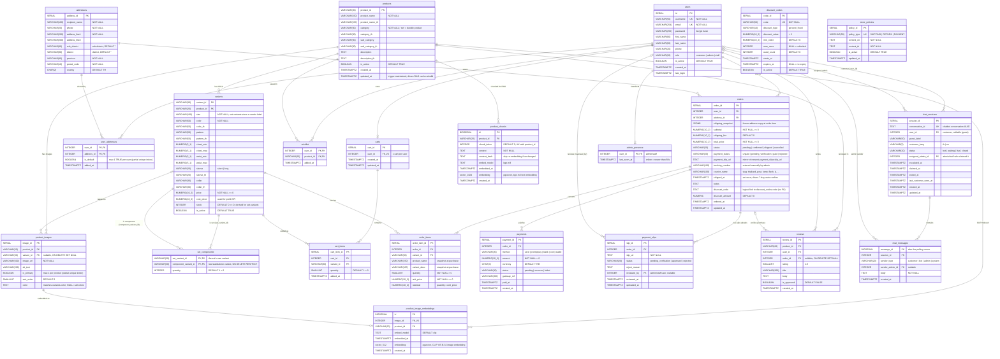

# Entity-Relationship Diagram — Kevin Web Shopping

Thai clothing e-commerce platform (bachelor's thesis) with an AI product chatbot
(RAG), image search (CLIP) and a live-chat "talk to a human" handoff.
Database: **PostgreSQL 15 + pgvector** — single source of truth for all data.

- **Source of truth:** `postgres/init/01_schema.sql` (up to date through migration `024_`)
- **22 tables** in 8 groups (see summary below)
- Notation: `PK` primary key, `FK` foreign key, `UK` unique. Types like
  `NUMERIC(10_2)` mean `NUMERIC(10,2)` (comma replaced so Mermaid can parse it).

> **Render options:**
> - GitHub / VS Code ("Markdown Preview Mermaid Support") render the block below automatically
> - Online: paste the `mermaid` block at [mermaid.live](https://mermaid.live)
> - CLI: `npx @mermaid-js/mermaid-cli -i ER_DIAGRAM.md -o ER_DIAGRAM.png`

---

```mermaid
erDiagram

    %% ─── CATALOGUE ───────────────────────────────────────────
    products {
        VARCHAR(20)     product_id      PK
        VARCHAR(150)    product_name    "NOT NULL"
        VARCHAR(150)    product_name_th
        VARCHAR(50)     category        "NOT NULL; 'set' = bundle product"
        VARCHAR(50)     category_th
        VARCHAR(50)     sub_category
        VARCHAR(50)     sub_category_th
        TEXT            description
        TEXT            description_th
        BOOLEAN         is_active       "DEFAULT TRUE"
        TIMESTAMPTZ     created_at
        TIMESTAMPTZ     updated_at      "trigger-maintained; drives RAG cache rebuild"
    }

    variants {
        VARCHAR(30)     variant_id      PK
        VARCHAR(20)     product_id      FK
        VARCHAR(100)    size            "NOT NULL; set-variants store a combo label"
        VARCHAR(50)     color           "NOT NULL"
        VARCHAR(50)     color_th
        VARCHAR(50)     pattern
        VARCHAR(50)     pattern_th
        NUMERIC(5_1)    chest_min
        NUMERIC(5_1)    chest_max
        NUMERIC(5_1)    waist_min
        NUMERIC(5_1)    waist_max
        VARCHAR(20)     sleeve          "short | long"
        VARCHAR(20)     sleeve_th
        VARCHAR(30)     collar
        VARCHAR(30)     collar_th
        NUMERIC(10_2)   price           "NOT NULL >= 0"
        NUMERIC(10_2)   cost_price      "used for profit KPI"
        INTEGER         stock           "DEFAULT 0 >= 0; derived for set-variants"
        BOOLEAN         is_active       "DEFAULT TRUE"
    }

    product_images {
        SERIAL          image_id        PK
        VARCHAR(20)     product_id      FK
        VARCHAR(30)     variant_id      FK "nullable, ON DELETE SET NULL"
        VARCHAR(500)    image_url       "NOT NULL"
        VARCHAR(200)    alt_text
        BOOLEAN         is_primary      "max 1 per product (partial unique index)"
        SMALLINT        sort_order      "DEFAULT 0"
        TEXT            color           "matches variants.color; NULL = all colors"
    }

    set_components {
        VARCHAR(30)     set_variant_id       PK,FK "the set's own variant"
        VARCHAR(30)     component_variant_id PK,FK "real standalone variant, ON DELETE RESTRICT"
        INTEGER         quantity             "DEFAULT 1 > 0"
    }

    %% ─── USERS & ADDRESSES ───────────────────────────────────
    users {
        SERIAL          id              PK
        VARCHAR(50)     username        UK "NOT NULL"
        VARCHAR(254)    email           UK "NOT NULL"
        VARCHAR(255)    password        "bcrypt hash"
        VARCHAR(80)     first_name
        VARCHAR(80)     last_name
        VARCHAR(20)     phone
        VARCHAR(20)     role            "customer | admin | staff"
        BOOLEAN         is_active       "DEFAULT TRUE"
        TIMESTAMPTZ     created_at
        TIMESTAMPTZ     last_login
    }

    addresses {
        SERIAL          address_id      PK
        VARCHAR(160)    recipient_name  "NOT NULL"
        VARCHAR(20)     phone           "NOT NULL"
        VARCHAR(200)    address_line1   "NOT NULL"
        VARCHAR(200)    address_line2
        VARCHAR(80)     sub_district    "sub-district, DEFAULT ''"
        VARCHAR(80)     district        "district, DEFAULT ''"
        VARCHAR(80)     province        "NOT NULL"
        VARCHAR(10)     postal_code     "NOT NULL"
        CHAR(2)         country         "DEFAULT TH"
    }

    user_addresses {
        INTEGER         user_id         PK,FK
        INTEGER         address_id      PK,FK
        BOOLEAN         is_default      "max 1 TRUE per user (partial unique index)"
        TIMESTAMPTZ     added_at
    }

    %% ─── CART & WISHLIST ─────────────────────────────────────
    carts {
        SERIAL          cart_id         PK
        INTEGER         user_id         FK,UK "1 cart per user"
        TIMESTAMPTZ     created_at
        TIMESTAMPTZ     updated_at
    }

    cart_items {
        SERIAL          cart_item_id    PK
        INTEGER         cart_id         FK
        VARCHAR(30)     variant_id      FK
        SMALLINT        quantity        "DEFAULT 1 > 0"
        TIMESTAMPTZ     added_at
    }

    wishlist {
        INTEGER         user_id         PK,FK
        VARCHAR(20)     product_id      PK,FK
        TIMESTAMPTZ     added_at
    }

    %% ─── ORDERS & PAYMENTS ───────────────────────────────────
    orders {
        SERIAL          order_id          PK
        INTEGER         user_id           FK
        INTEGER         address_id        FK
        JSONB           shipping_snapshot "frozen address copy at order time"
        NUMERIC(10_2)   subtotal          "NOT NULL >= 0"
        NUMERIC(10_2)   shipping_fee      "DEFAULT 0"
        NUMERIC(10_2)   total_price       "NOT NULL >= 0"
        VARCHAR(20)     status            "pending | confirmed | shipped | cancelled"
        VARCHAR(20)     payment_status    "unpaid | pending_verification | paid | rejected"
        TEXT            payment_slip_url  "mirror of newest payment_slips.slip_url"
        VARCHAR(100)    tracking_number   "entered manually by admin"
        VARCHAR(100)    courier_name      "slug: thailand_post, kerry, flash, jt, ..."
        TIMESTAMPTZ     shipped_at        "set once; drives 7-day auto-confirm"
        TEXT            notes
        TEXT            discount_code     "logical link to discount_codes.code (no FK)"
        NUMERIC         discount_amount   "DEFAULT 0"
        TIMESTAMPTZ     ordered_at
        TIMESTAMPTZ     updated_at
    }

    order_items {
        SERIAL          order_item_id   PK
        INTEGER         order_id        FK
        VARCHAR(30)     variant_id      FK
        VARCHAR(150)    product_name    "snapshot at purchase"
        VARCHAR(100)    variant_desc    "snapshot at purchase"
        SMALLINT        quantity        "NOT NULL > 0"
        NUMERIC(10_2)   unit_price      "NOT NULL >= 0"
        NUMERIC(10_2)   subtotal        "quantity x unit_price"
    }

    payments {
        SERIAL          payment_id      PK
        INTEGER         order_id        FK
        VARCHAR(20)     method          "card | promptpay | bank | cod | wallet"
        NUMERIC(10_2)   amount          "NOT NULL > 0"
        CHAR(3)         currency        "DEFAULT THB"
        VARCHAR(20)     status          "pending | success | failed"
        VARCHAR(200)    gateway_ref
        TIMESTAMPTZ     paid_at
        TIMESTAMPTZ     created_at
    }

    payment_slips {
        SERIAL          slip_id         PK
        INTEGER         order_id        FK
        TEXT            slip_url        "NOT NULL"
        VARCHAR(20)     status          "pending_verification | approved | rejected"
        TEXT            reject_reason
        INTEGER         reviewed_by     FK "admin/staff user, nullable"
        TIMESTAMPTZ     reviewed_at
        TIMESTAMPTZ     uploaded_at
    }

    %% ─── REVIEWS & PROMOTIONS ────────────────────────────────
    reviews {
        SERIAL          review_id       PK
        VARCHAR(20)     product_id      FK
        INTEGER         user_id         FK
        INTEGER         order_id        FK "nullable, ON DELETE SET NULL"
        SMALLINT        rating          "1-5"
        VARCHAR(200)    title
        TEXT            body
        BOOLEAN         is_approved     "DEFAULT FALSE"
        TIMESTAMPTZ     created_at
    }

    discount_codes {
        SERIAL          code_id         PK
        VARCHAR(50)     code            UK "NOT NULL"
        VARCHAR(10)     discount_type   "percent | fixed"
        NUMERIC(10_2)   discount_value  "> 0"
        NUMERIC(10_2)   min_order       "DEFAULT 0"
        INTEGER         max_uses        "NULL = unlimited"
        INTEGER         used_count      "DEFAULT 0"
        TIMESTAMPTZ     starts_at
        TIMESTAMPTZ     expires_at      "NULL = no expiry"
        BOOLEAN         is_active       "DEFAULT TRUE"
    }

    store_policies {
        SERIAL          policy_id       PK
        VARCHAR(50)     policy_type     UK "SHIPPING | RETURN | PAYMENT"
        TEXT            content_en      "NOT NULL"
        TEXT            content_th      "NOT NULL"
        BOOLEAN         is_active       "DEFAULT TRUE"
        TIMESTAMPTZ     updated_at
    }

    %% ─── AI / VECTOR TABLES ──────────────────────────────────
    product_chunks {
        BIGSERIAL       id              PK
        VARCHAR(20)     product_id      FK
        INTEGER         chunk_index     "DEFAULT 0; UK with product_id"
        TEXT            content         "NOT NULL"
        TEXT            content_hash    "skip re-embedding if unchanged"
        TEXT            embed_model     "bge-m3"
        TIMESTAMPTZ     embedded_at
        vector_1024     embedding       "pgvector, bge-m3 text embedding"
        TIMESTAMPTZ     created_at
    }

    product_image_embeddings {
        BIGSERIAL       id              PK
        INTEGER         image_id        FK,UK
        VARCHAR(20)     product_id      FK
        TEXT            embed_model     "DEFAULT clip"
        TIMESTAMPTZ     embedded_at
        vector_512      embedding       "pgvector, CLIP ViT-B-32 image embedding"
        TIMESTAMPTZ     created_at
    }

    %% ─── LIVE CHAT HANDOFF ───────────────────────────────────
    chat_sessions {
        SERIAL          session_id            PK
        TEXT            conversation_id       UK "chatbot conversation UUID"
        INTEGER         user_id               FK "customer, nullable (guest)"
        VARCHAR(50)     guest_label
        VARCHAR(5)      customer_lang         "th | en"
        VARCHAR(20)     status                "bot | waiting | live | closed"
        INTEGER         assigned_admin_id     FK "admin/staff who claimed it"
        TIMESTAMPTZ     escalated_at
        TIMESTAMPTZ     claimed_at
        TIMESTAMPTZ     ended_at
        TIMESTAMPTZ     last_customer_seen_at
        TIMESTAMPTZ     created_at
        TIMESTAMPTZ     updated_at
    }

    chat_messages {
        BIGSERIAL       message_id      PK "also the polling cursor"
        INTEGER         session_id      FK
        VARCHAR(20)     sender_type     "customer | bot | admin | system"
        INTEGER         sender_admin_id FK "nullable"
        TEXT            body            "NOT NULL"
        TIMESTAMPTZ     created_at
    }

    admin_presence {
        INTEGER         user_id         PK,FK "admin/staff"
        TIMESTAMPTZ     last_seen_at    "online = newer than 60s"
    }

    %% ─── RELATIONSHIPS ───────────────────────────────────────

    %% Catalogue
    products       ||--o{  variants                  : "has SKUs"
    products       ||--o{  product_images             : "has images"
    variants       |o--o{  product_images             : "tagged to"
    variants       ||--o{  set_components             : "is set (set_variant_id)"
    variants       ||--o{  set_components             : "is component (component_variant_id)"

    %% Users & addresses (many-to-many; user_addresses is the only link)
    users          ||--o{  user_addresses             : "has access to"
    addresses      ||--o{  user_addresses             : "shared by"

    %% Cart & wishlist
    users          ||--o|  carts                      : "owns"
    carts          ||--o{  cart_items                 : "contains"
    variants       ||--o{  cart_items                 : "added as"
    users          ||--o{  wishlist                   : "saves"
    products       ||--o{  wishlist                   : "saved in"

    %% Orders & payments
    users          ||--o{  orders                     : "places"
    addresses      ||--o{  orders                     : "ships to"
    orders         ||--|{  order_items                : "contains"
    variants       ||--o{  order_items                : "sold as"
    orders         ||--o{  payments                   : "paid by"
    orders         ||--o{  payment_slips              : "has slip uploads"
    users          |o--o{  payment_slips              : "reviews (reviewed_by)"

    %% Reviews
    products       ||--o{  reviews                    : "reviewed in"
    users          ||--o{  reviews                    : "writes"
    orders         |o--o{  reviews                    : "verifies purchase"

    %% AI tables
    products       ||--o{  product_chunks             : "chunked for RAG"
    products       ||--o{  product_image_embeddings   : "CLIP indexed"
    product_images ||--o|  product_image_embeddings   : "embedded as"

    %% Live chat handoff
    users          |o--o{  chat_sessions              : "customer (user_id)"
    users          |o--o{  chat_sessions              : "assigned admin"
    chat_sessions  ||--o{  chat_messages              : "contains"
    users          |o--o{  chat_messages              : "admin sender"
    users          ||--o|  admin_presence             : "heartbeat"
```

---

## Table groups

| Group | Tables | Purpose |
|---|---|---|
| **Catalogue** | `products`, `variants`, `product_images`, `set_components` | Products, SKU-level price/stock, gallery, product sets (bundles) |
| **Users** | `users`, `addresses`, `user_addresses` | Accounts (customer/admin/staff), shareable shipping addresses |
| **Cart & wishlist** | `carts`, `cart_items`, `wishlist` | Active cart (1 per user), saved products |
| **Orders & payments** | `orders`, `order_items`, `payments`, `payment_slips` | Checkout, PromptPay slip upload/verification history, shipping tracking |
| **Reviews & promotions** | `reviews`, `discount_codes` | Product reviews, coupon codes |
| **Store content** | `store_policies` | Shipping/return/payment policy (TH + EN), used by the policy page and chatbot |
| **AI / vector** | `product_chunks`, `product_image_embeddings` | RAG chatbot (bge-m3, vector 1024), image search (CLIP, vector 512) |
| **Live chat** | `chat_sessions`, `chat_messages`, `admin_presence` | Chatbot transcript and escalation to a human admin |

## Relationships not enforced by a foreign key

These are logical links in application code only. They show up in the
diagram as a note, not as a relationship line:

- `orders.discount_code` → `discount_codes.code`: stored as plain text. A code can be deleted or edited later without affecting past orders.
- `product_images.color` → `variants.color`: matched by string value. `NULL` means the photo applies to every color.
- `orders.payment_slip_url` is a copy of the newest `payment_slips.slip_url`.
- `order_items.product_name` / `variant_desc` and `orders.shipping_snapshot` are **snapshots** frozen at order time, on purpose. Editing products or addresses later doesn't change old orders.

## Key constraints & business rules

- `variants.product_id` → `products` ON DELETE CASCADE; `order_items.variant_id` has **no** ON DELETE, so a sold variant can't be deleted.
- `product_images`: partial unique index `(product_id) WHERE is_primary` allows at most one primary image per product.
- `set_components`: PK `(set_variant_id, component_variant_id)`. A set-variant's `stock` is **derived** by trigger as `MIN(component.stock / quantity)` and recomputed whenever a component's stock changes. All components in one set must share the same `pattern` (checked in the backend).
- `user_addresses`: PK `(user_id, address_id)` is the **only** link between users and addresses (many-to-many, e.g. family members sharing an address). `addresses` has no owner column (`addresses.user_id` and `users.address` were dropped in `024_`). Partial unique index `(user_id) WHERE is_default` allows at most one default address per user. Deleting a saved address only removes the link; the `addresses` row is kept while an order still references it.
- `carts.user_id` UNIQUE (one cart per user); `cart_items` UNIQUE `(cart_id, variant_id)`.
- `wishlist`: PK `(user_id, product_id)`.
- `reviews`: UNIQUE `(product_id, user_id, order_id)`, one review per purchase.
- `orders.status` flow: `pending → confirmed` (payment approved) `→ shipped → confirmed` (customer clicks "received", or auto-confirm after 7 days). `cancelled` is terminal and restores stock and the discount-code use.
- `payment_slips`: one row per upload, never deleted. A rejected slip can be re-uploaded, which adds a new row.
- `chat_sessions.conversation_id` UNIQUE; `chat_messages.message_id` is monotonic and used as the polling cursor.
- `product_chunks` UNIQUE `(product_id, chunk_index)`; `product_image_embeddings.image_id` UNIQUE (one embedding per image).
- Password reset uses a stateless JWT and has **no table**.

## Vector columns

| Table | Column | Model | Dimension | Use | Query operator |
|---|---|---|---|---|---|
| `product_chunks` | `embedding` | bge-m3 (Ollama) | 1024 | Chatbot RAG text retrieval | `<=>` cosine distance |
| `product_image_embeddings` | `embedding` | CLIP ViT-B-32 | 512 | Image search | `<=>` cosine distance |
